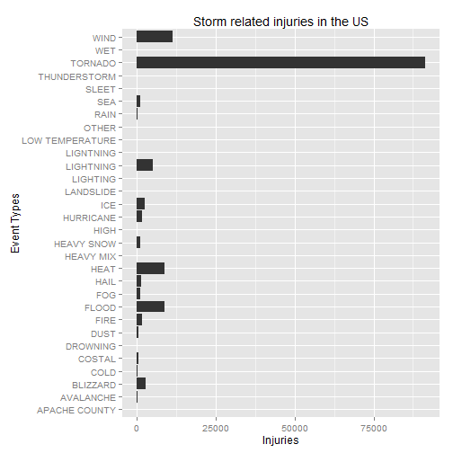
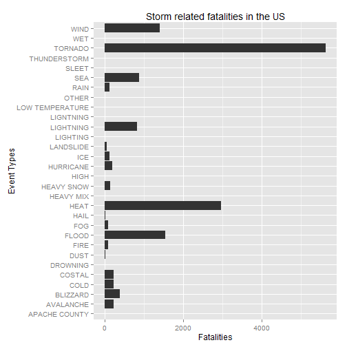
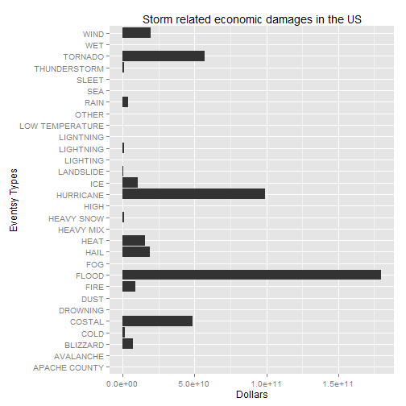

##Synopsis

The analysis is of the effects that storms have on health and the economy. The dataset used in this exploratory analysis is from the U.S. National Oceanic and Atmospheric Administration's (NOAA) storm database, a link to which is [here](http://d396qusza40orc.cloudfront.net/repdata%2Fdata%2FStormData.csv.bz2). 

Two questions are explored: 

1. Across the United States, which types of events (as indicated in the EVTYPE variable) are most harmful with respect to population health? 

2. Across the United States, which types of events have the greatest economic consequences? 

The data is downloaded and cleaned in respect to missing values and errors in Event Types. The total amount of injuries, fatalities, property and crop damages are extracted and graphed in relation to Event Types. 

Tornado events are found to cause the most injuries and fatalities collectively whereas floods are found to cause the most economic damage.

##Data Processing

The data is downloaded, decompressed and read in from a csv file.

```r
if(!file.exists("repdata_data_StormData.csv.bz2"))
    download.file("http://d396qusza40orc.cloudfront.net/repdata%2Fdata%2FStormData.csv.bz2", "curl")
if(!file.exists("repdata_data_StormData.csv"))
    bunzip("repdata_data_StormData.csv.bz2")
StormData <- read.table("repdata_data_StormData.csv", sep = ",", header=T, na.strings="?")
```

Contents of the Storm dataset. 

```r
str(StormData)
```

```
## 'data.frame':	902297 obs. of  37 variables:
##  $ STATE__   : num  1 1 1 1 1 1 1 1 1 1 ...
##  $ BGN_DATE  : Factor w/ 16335 levels "1/1/1966 0:00:00",..: 6523 6523 4242 11116 2224 2224 2260 383 3980 3980 ...
##  $ BGN_TIME  : Factor w/ 3608 levels "00:00:00 AM",..: 272 287 2705 1683 2584 3186 242 1683 3186 3186 ...
##  $ TIME_ZONE : Factor w/ 22 levels "ADT","AKS","AST",..: 7 7 7 7 7 7 7 7 7 7 ...
##  $ COUNTY    : num  97 3 57 89 43 77 9 123 125 57 ...
##  $ COUNTYNAME: Factor w/ 29601 levels "","5NM E OF MACKINAC BRIDGE TO PRESQUE ISLE LT MI",..: 13513 1873 4598 10592 4372 10094 1973 23873 24418 4598 ...
##  $ STATE     : Factor w/ 72 levels "AK","AL","AM",..: 2 2 2 2 2 2 2 2 2 2 ...
##  $ EVTYPE    : Factor w/ 984 levels "   HIGH SURF ADVISORY",..: 833 833 833 833 833 833 833 833 833 833 ...
##  $ BGN_RANGE : num  0 0 0 0 0 0 0 0 0 0 ...
##  $ BGN_AZI   : Factor w/ 35 levels "","  N"," NW",..: 1 1 1 1 1 1 1 1 1 1 ...
##  $ BGN_LOCATI: Factor w/ 54428 levels "","- 1 N Albion",..: 1 1 1 1 1 1 1 1 1 1 ...
##  $ END_DATE  : Factor w/ 6663 levels "","1/1/1993 0:00:00",..: 1 1 1 1 1 1 1 1 1 1 ...
##  $ END_TIME  : Factor w/ 3646 levels ""," 0900CST",..: 1 1 1 1 1 1 1 1 1 1 ...
##  $ COUNTY_END: num  0 0 0 0 0 0 0 0 0 0 ...
##  $ COUNTYENDN: logi  NA NA NA NA NA NA ...
##  $ END_RANGE : num  0 0 0 0 0 0 0 0 0 0 ...
##  $ END_AZI   : Factor w/ 24 levels "","E","ENE","ESE",..: 1 1 1 1 1 1 1 1 1 1 ...
##  $ END_LOCATI: Factor w/ 34506 levels "","- .5 NNW",..: 1 1 1 1 1 1 1 1 1 1 ...
##  $ LENGTH    : num  14 2 0.1 0 0 1.5 1.5 0 3.3 2.3 ...
##  $ WIDTH     : num  100 150 123 100 150 177 33 33 100 100 ...
##  $ F         : int  3 2 2 2 2 2 2 1 3 3 ...
##  $ MAG       : num  0 0 0 0 0 0 0 0 0 0 ...
##  $ FATALITIES: num  0 0 0 0 0 0 0 0 1 0 ...
##  $ INJURIES  : num  15 0 2 2 2 6 1 0 14 0 ...
##  $ PROPDMG   : num  25 2.5 25 2.5 2.5 2.5 2.5 2.5 25 25 ...
##  $ PROPDMGEXP: Factor w/ 18 levels "","-","+","0",..: 16 16 16 16 16 16 16 16 16 16 ...
##  $ CROPDMG   : num  0 0 0 0 0 0 0 0 0 0 ...
##  $ CROPDMGEXP: Factor w/ 8 levels "","0","2","B",..: 1 1 1 1 1 1 1 1 1 1 ...
##  $ WFO       : Factor w/ 542 levels ""," CI","$AC",..: 1 1 1 1 1 1 1 1 1 1 ...
##  $ STATEOFFIC: Factor w/ 250 levels "","ALABAMA, Central",..: 1 1 1 1 1 1 1 1 1 1 ...
##  $ ZONENAMES : Factor w/ 25112 levels "","                                                                                                                               "| __truncated__,..: 1 1 1 1 1 1 1 1 1 1 ...
##  $ LATITUDE  : num  3040 3042 3340 3458 3412 ...
##  $ LONGITUDE : num  8812 8755 8742 8626 8642 ...
##  $ LATITUDE_E: num  3051 0 0 0 0 ...
##  $ LONGITUDE_: num  8806 0 0 0 0 ...
##  $ REMARKS   : Factor w/ 436774 levels "","-2 at Deer Park\n",..: 1 1 1 1 1 1 1 1 1 1 ...
##  $ REFNUM    : num  1 2 3 4 5 6 7 8 9 10 ...
```

To clean up the dataset, the fatalities, injuries, property damages, crop damages, property damages exponent and crop damages exponenet columns are extracted. This reduces the width of the dataset from 37 columns to just 7 columns.

```r
StormClean <- StormData[StormData$FATALITIES>0|StormData$INJURIES>0|StormData$PROPDMG>0|StormData$CROPDMG>0,c(8,23,24,25,26,27,28)]
str(StormClean)
```

```
## 'data.frame':	254633 obs. of  7 variables:
##  $ EVTYPE    : Factor w/ 984 levels "   HIGH SURF ADVISORY",..: 833 833 833 833 833 833 833 833 833 833 ...
##  $ FATALITIES: num  0 0 0 0 0 0 0 0 1 0 ...
##  $ INJURIES  : num  15 0 2 2 2 6 1 0 14 0 ...
##  $ PROPDMG   : num  25 2.5 25 2.5 2.5 2.5 2.5 2.5 25 25 ...
##  $ PROPDMGEXP: Factor w/ 18 levels "","-","+","0",..: 16 16 16 16 16 16 16 16 16 16 ...
##  $ CROPDMG   : num  0 0 0 0 0 0 0 0 0 0 ...
##  $ CROPDMGEXP: Factor w/ 8 levels "","0","2","B",..: 1 1 1 1 1 1 1 1 1 1 ...
```

As there are many duplicate Event Type categories and spelling mistakes, an attempt to reduce the amount of unique Event Type categories is made by grouping similar event types. 

```r
StormClean$EVTYPE <- toupper(StormClean$EVTYPE)
StormClean$EVTYPE[grep('SURF|COASTAL|SURGE|CSTL|TSUNAMI', StormClean$EVTYPE)] <- 'COSTAL'
StormClean$EVTYPE[grep('RIP|TIDE|MARINE|SEA|WAVE|SWELL|WATERSPOUT', StormClean$EVTYPE)] <- 'SEA'
StormClean$EVTYPE[grep('RIVER|URBAN|FLASH|LAKE|DAM|FLOOD|WATER|SEICHE', StormClean$EVTYPE)] <- 'FLOOD'
StormClean$EVTYPE[grep('WET', StormClean$EVTYPE)] <- 'WET'
StormClean$EVTYPE[grep('LAND|MUD|ROCK|EROSION', StormClean$EVTYPE)] <- 'LANDSLIDE'
StormClean$EVTYPE[grep('FOG', StormClean$EVTYPE)] <- 'FOG'
StormClean$EVTYPE[grep('RAIN|BURST|PRECIP|SHOWER', StormClean$EVTYPE)] <- 'RAIN'
StormClean$EVTYPE[grep('LIGHTNING', StormClean$EVTYPE)] <- 'LIGHTNING'
StormClean$EVTYPE[grep('WIND|TURBUL', StormClean$EVTYPE)] <- 'WIND'
StormClean$EVTYPE[grep('COLD|HYPO', StormClean$EVTYPE)] <- 'COLD'
StormClean$EVTYPE[grep('THUNDERSTORM|TSTM', StormClean$EVTYPE)] <- 'THUNDERSTORM'
StormClean$EVTYPE[grep('HAIL', StormClean$EVTYPE)] <- 'HAIL'
StormClean$EVTYPE[grep('TORNADO|TORNDAO|FUNNEL', StormClean$EVTYPE)] <- 'TORNADO'
StormClean$EVTYPE[grep('HURRICANE|TROPICAL|STORM WIND|TYPHOON', StormClean$EVTYPE)] <- 'HURRICANE'
StormClean$EVTYPE[grep('DUST|GUSTNADO', StormClean$EVTYPE)] <- 'DUST'
StormClean$EVTYPE[grep('WARM|HEAT|DROUGHT|HYPER', StormClean$EVTYPE)] <- 'HEAT'
StormClean$EVTYPE[grep('FIRE|SMOKE|ASH', StormClean$EVTYPE)] <- 'FIRE'
StormClean$EVTYPE[grep('SNOW', StormClean$EVTYPE)] <- 'HEAVY SNOW'
StormClean$EVTYPE[grep('ICE|FREEZ|FROST|ICY|GLAZE', StormClean$EVTYPE)] <- 'ICE'
StormClean$EVTYPE[grep('AVALAN', StormClean$EVTYPE)] <- 'AVALANCHE'
StormClean$EVTYPE[grep('BLIZZ|WINTER STORM|WINTER WEATHER|WINTRY MIX', StormClean$EVTYPE)] <- 'BLIZZARD'
```

Newly distilled Event Type categories. The number of Event Types are reduced from 984 to just 31.

```r
unique(StormClean$EVTYPE)
```

```
##  [1] "TORNADO"         "WIND"            "HAIL"           
##  [4] "FLOOD"           "BLIZZARD"        "HURRICANE"      
##  [7] "RAIN"            "LIGHTNING"       "FOG"            
## [10] "SEA"             "THUNDERSTORM"    "HEAT"           
## [13] "COLD"            "ICE"             "AVALANCHE"      
## [16] "COSTAL"          "HEAVY SNOW"      "DUST"           
## [19] "APACHE COUNTY"   "SLEET"           "FIRE"           
## [22] "HIGH"            "LANDSLIDE"       "LIGNTNING"      
## [25] "WET"             "HEAVY MIX"       "LIGHTING"       
## [28] "LOW TEMPERATURE" NA                "OTHER"          
## [31] "DROWNING"
```

The values of property and crop damages are represented by a character representation of an exponential value and a multiplier in two separate columns. The actual integer value of property and crop damages are calculated and assigned to their respective columns, property damages and crop damages. 

```r
StormClean$PROPDMG <- ifelse(StormClean$PROPDMGEXP=='K', StormClean$PROPDMG*1000, StormClean$PROPDMG)
StormClean$PROPDMG <- ifelse(StormClean$PROPDMGEXP=='M', StormClean$PROPDMG*1000000, StormClean$PROPDMG)
StormClean$PROPDMG <- ifelse(StormClean$PROPDMGEXP=='B', StormClean$PROPDMG*1000000000, StormClean$PROPDMG)
StormClean$CROPDMG <- ifelse(StormClean$CROPDMGEXP=='K', StormClean$CROPDMG*1000, StormClean$CROPDMG)
StormClean$CROPDMG <- ifelse(StormClean$CROPDMGEXP=='M', StormClean$CROPDMG*1000000, StormClean$CROPDMG)
StormClean$CROPDMG <- ifelse(StormClean$CROPDMGEXP=='B', StormClean$CROPDMG*1000000000, StormClean$CROPDMG)
```

The total number of injuries and fatalities for each Event Type are calculated and stored. In dollars, the sum total of both property and crop damages for each Event Type is calculated and stored.

```r
injuryData <- aggregate(StormClean$INJURIES, by=list(StormClean$EVTYPE), FUN=sum)
names(injuryData) <- c("EVTYPE","INJURIES")
fatalityData <- aggregate(StormClean$FATALITIES, by=list(StormClean$EVTYPE), FUN=sum)
names(fatalityData) <- c("EVTYPE","FATALITIES")
economy <- aggregate(StormClean$PROPDMG + StormClean$CROPDMG, by=list(StormClean$EVTYPE), FUN=sum, na.rm=TRUE)
names(economy) <- c("EVTYPE","VALUE")
```

The results are combined into one dataset.

```r
final <- data.frame(injuryData$EVTYPE, injuryData$INJURIES, fatalityData$FATALITIES, economy$VALUE)
names(final) <- c("EVTYPE","INJURIES","FATALITIES","VALUE")
final
```

```
##             EVTYPE INJURIES FATALITIES     VALUE
## 1    APACHE COUNTY        0          0 5.000e+03
## 2        AVALANCHE      170        225 3.722e+06
## 3         BLIZZARD     2758        379 7.531e+09
## 4             COLD      279        232 1.438e+09
## 5           COSTAL      427        233 4.868e+10
## 6         DROWNING        0          1 0.000e+00
## 7             DUST      483         24 9.491e+06
## 8             FIRE     1608         90 8.901e+09
## 9            FLOOD     8683       1551 1.799e+11
## 10             FOG     1077         81 2.501e+07
## 11            HAIL     1371         15 1.902e+10
## 12            HEAT     8836       2958 1.593e+10
## 13       HEAVY MIX        0          0 1.305e+06
## 14      HEAVY SNOW     1119        144 1.109e+09
## 15            HIGH        1          0 0.000e+00
## 16       HURRICANE     1714        199 9.914e+10
## 17             ICE     2417        114 1.069e+10
## 18       LANDSLIDE       55         44 3.475e+08
## 19        LIGHTING        0          0 5.000e+03
## 20       LIGHTNING     5232        817 9.461e+08
## 21       LIGNTNING        0          0 5.000e+03
## 22 LOW TEMPERATURE        0          7 0.000e+00
## 23           OTHER        4          0 1.090e+06
## 24            RAIN      362        118 4.044e+09
## 25             SEA     1113        871 1.366e+08
## 26           SLEET        0          2 0.000e+00
## 27    THUNDERSTORM       39          1 1.227e+09
## 28         TORNADO    91367       5633 5.735e+10
## 29             WET        0          0 2.130e+08
## 30            WIND    11413       1406 1.976e+10
```

##Analysis

The total number of Injuries are plotted against Event Type.

```r
library(ggplot2)
ggplot(final, aes(x=EVTYPE, y=INJURIES)) +
  geom_bar(stat="identity") + coord_flip()+labs(title="Storm related injuries in the US")+labs(x="Event Types")+labs(y="Injuries")
```

 

The total number of Fatalities are plotted against Event Type.

```r
ggplot(final, aes(x=EVTYPE, y=FATALITIES)) +
  geom_bar(stat="identity") + coord_flip()+labs(title="Storm related fatalities in the US")+labs(x="Event Types")+labs(y="Fatalities")
```

 

The sum total of both property and crop damages are plotted against Event Type.

```r
library(ggplot2)
ggplot(final, aes(x=EVTYPE, y=VALUE)) +
  geom_bar(stat="identity") + coord_flip()+labs(title="Storm related economic damages in the US")+labs(x="Eventsy Types")+labs(y="Dollars")
```

 

##Results

The analysis answers the two questions as stated in the synopsis. 

1. Across the United States, which types of events (as indicated in the EVTYPE variable) are most harmful with respect to population health? 

It is shown through sheer numbers and visually through the above graphs that tornadoes cause the most injuries and fatalities in total in this dataset.

2. Across the United States, which types of events have the greatest economic consequences? 

The second part of the analysis is a little harder to answer. The numbers and graph tell us that flooding has the greatest economic consequence. Although, if the dataset were better categorised or processed by the author, it may show us that some or many hurricanes may have a great part in creating some of these floods. This could possibly reverse or level the actual values of floods and hurricanes on the graph. 

##End Of Paper
